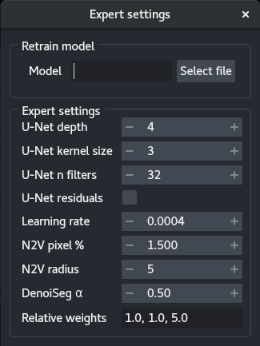

# Documentation

`napari-denoiseg` is based on the original algorithm from the Jug lab: [DenoiSeg](https://github.com/juglab/DenoiSeg), 
and uses [CSBDeep](http://csbdeep.bioimagecomputing.com/). [DenoiSeg](https://arxiv.org/abs/2005.02987) is 
an algorithm allowing the joint denoising and segmentation of microscopy data using little ground-truth annotation. 
DenoiSeg is an offshoot of [Noise2Void](https://github.com/juglab/n2v).

`napari-denoiseg` contains three different napari plugins: `DenoiSeg train`, `DenoiSeg optimize` and `DenoiSeg predict`. 

1. [DenoiSeg train](#denoiseg-train)
2. [DenoiSeg optimize](#denoiseg-optimize)
3. [DenoiSeg predict](#denoiseg-predict)

## DenoiSeg train

### Anatomy

1. [GPU availability](#1---gpu-availability)
2. [Data loading](#2---data-loading)
3. [Training parameters](#3---training-parameters)
4. [Expert training parameters](#4---expert-training-parameters)
5. [Training](#5---training)
6. [Training progress](#6----training-progress)
7. [Model saving](#7---model-saving)

### 1 - GPU availability

This small widget checks whether a GPU device is available to TensorFlow. If the GPU is available, then you will see the following:

If the GPU is not available, the widget will show a yellow `CPU`.

GPU availability does not ensure that the code will run on the GPU, but it is a necessary condition. 

### 2 - Data loading

The data loading panel has two tabs: `From layers` and `From disk` :

1. From layers:
Choose among the available napari layers data for the `Train` and `Val`. Note that if `Val` is empty or equal to `Train`, a portion of the training data will be extracted as validation data.
2. From disk:
Use the `choose` button to point to folders containing images. The images can be of different dimensions but should have the same axes (e.g. TXY). 
Note that if `Val` is empty or equal to `Train`, a portion of the training data will be extracted as validation data.
When selecting a folder for the `Train` set, the first image will be loaded as sample into napari to estimate the axes (see Axes in the next section).

  

### 3 - Training parameters

The training parameters are the basic settings you can use to tune your DenoiSeg training:

- `Axes`:
This widget allows specifying your data axes order. Only a few axes are allowed: S(ample) (equivalent to a roi), T(ime), Z, X, Y and C(hannel), in any order. This knowledge is important for the algorithm as not all axes are treated the same way. S and T axes are merged, as time points are considered independent regions of interest. Z, X and Y are moved to their respective place. Finally, if a C axis exists, independent networks are trained for each channel. 
The default text is the most likely axes order, and depends on whether the data has a Z dimension (see `Enable 3D`).
The axes widget text is highlighted in orange if there are not enough (or too many) axes with respect to the images (in the layers or a sample loaded from the disk) or if `Enable 3D` is selected but no `Z` appears in the `Axes`.
The text turns red when an axis is duplicated or invalid. 
Training can only start when the axes widget has a valid entry.
- `Enable 3D`:
Select for data with a Z dimension. Enabling Z changes the constraints of `Axes` and allows setting a `Patch Z`.
- `N epochs`: 
The number of epochs is meant to be the number of times the network will see the whole training data set during training. The more epochs, the longer the training.
- `N steps`:
The steps are the number of image batches used for training during an epoch. The number of steps should be set so as to approximately verify the following equality:
$S = P / B$
where $S$ is the number of steps, $P$ the number of patches and $B$ the batch size (see `Batch size`). 
The number of patches can be difficult to estimate, as it depends on `Patch XY`, the size of your images and augmentation. The output of the plugin prints the number of patches to the terminal.
- `Batch size`:
Size of the image batch used at each step. 
Note that because the batches are loading directly onto the GPU, large batches can cause out of memory (OOM) errors. If GPU memory is a problem, reduce the batch size.
- `Patch XY`:
Dimensions in X and Y of the patches. Patches are extracted from the images. Patch size should be large enough to encompass useful details about the local structures of the image. Large patch size will cause the batches to be too large for the GPU memory, and should therefore be reduced should the memory be limiting.
Note that path size should a multiple of 8 and no smaller than 16.
If the patch size is too small, DenoiSeg can throw an error because less than 1 pixel is masked per patch, in such case increase the percentage of masked pixels (see Expert settings).
- `Patch Z`: 
Similar to `Patch XY`, albeit for the Z axis.

### 4 - Expert training parameters

The expert training parameters can be set by clicking on the gear button, modifying the relevant settings and closing the window.

- `Model`:
Select a `.h5` or `.biomage.io.zip` file to retrain a model. 
The models should be compatible. The plugin will automatically search for a `config.json` file in the same folder and throw an error if not found.
- `U-Net depth`:
Depth of the underlying U-Net architecture. Larger architectures are capable of generalizing better but are more complex to train.
- `U-Net kernel size`:
Size of the convolution filters in all dimensions.
- `U-Net n filters`:
Number of filters in the first convolutional layers. This value is doubled after each down-sampling operation.
- `U-Net residuals`:
Predict deep residuals internally.
- `Learning rate`:
The starting learning rate influences the speed of convergence.
- `N2V pixel %`:
Percentage of patch pixels to be masked.
- `N2V radius`:
Neighborhood radius of the n2v manipulator.
- `Denoiseg α`:
Weight of the denoising in the loss.
- `Relative weights`:
Relative weights of the three segmentation classes (background, foreground, border).

### 5 - Training

Depending on the stage of the training, the `Training` panel has different buttons:

- `Train`:
Start training a network on the data given the current parameters.
- `Stop`:
Stop the training. The model can be directly saved afterwards.
- `Reset model`:
Reset the model, the next training session will be from scratch. After resetting the model, information on the previously trained network is lost and prediction or saving the model is no longer possible.
- `Continue training`:
Continue training using the current parameters but the trained network weights.
> Note that the continuing training will train with the same parameters as before, to the exception of the number of epochs, 
which can be updated.

During training, the log and the weights are saved to a hidden folder in your `/home/`, under `.napari/DenoiSeg/models`. 

### 6 -  Training progress

The training progress panel shows the following:

- Progress in terms of epochs
- Progress in terms of steps for the current epoch
- Training and validation loss throughout the epochs. You can use the mouse wheel to zoom in or out of the graph, and you can click on the `A` button to resize automatically the graph.
- `Open in TensorBoard` opens TensorBoard in a new tab in your browser.

### 7 - Model saving

After training, the model can be saved to the location of your choice. Aside from saving the model weights, the plugin also saves a `config.json` file containing all the parameters of the training.. The model weights can be saved in two formats:

- `[Bioimage.io](http://Bioimage.io)`:
The [Bioimage.io](https://bioimage.io/#/?partner=deepimagej&type=all) format.
- `TensorFow`:
The model is saved as a `.h5` file.

## DenoiSeg optimize

The optimize threshold helps you determine the best threshold for prediction based on images with ground-truth (e.g. validation set).

> **Important**: it is better to use the validation set or new data to run the optimize threshold, rather than the training data. Indeed the model has been trained to perform specifically well on the training set, and the best threshold obtained with training data might not generalize well to data unseen during training.

The plugin works loads images and labels from the `napari` or from the disk. It then predicts results for all images using a trained model, thresholds the resulting foreground image and measure a metrics (accuracy, similar to Jaccard).

Use the threshold with the best accuracy in the prediction.

## DenoiSeg predict

### Anatomy

Multiple aspects of the `DenoiSeg - predict` plugin are similar to the `DenoiSeg - train` plugin, refer to the latter one for missing information.

1. [Data loading](#1---data-loading)
2. [Parameters](#2---parameters)
3. [Tiling](#3---tiling)
4. [Threshold](#4---threshold)
5. [Prediction](#5---predict)

### 1 - Data loading

Data can be loaded directly from napari layers or from the disk. 

- From napari layers:
The predicted images will be added to napari in a new layer but will not be saved to the disk.
- From disk:
If the images can be stacked (same X, Y and, if applicable, Z dimensions), then the predictions will be added to napari as a new layer but will not be saved to the disk.
If they can’t be stacked, then the images are all loaded as a list and the predictions are saved to the disk in the same folder, under `/results/`. 
In addition, a `lazy loading` checkbox allows predicting the images one at a time. Note that if `lazy loading` is selected, the images are saved to the disk directly even if their dimensions match.

Note that if you select a training folder, the plugin will try to load the first image it finds in order to assert the axes.

### 2 - Parameters

The parameters `Axes` and `Enable 3D` are similar to the corresponding ones in `DenoiSeg - Train`. In addition, model weights should be loaded from the disk and should correspond to a `config.json` file in the same folder. The plugin throws an error if no configuration is found.

### 3 - Tiling

- `Tile prediction`:
Use tiling to predict the images. Tiling allows breaking large images in smaller chunks in order to fit in the GPU memory.
- `Number of tiles`:
Number of tiles to user per image.

### 4 - Threshold

Select `Apply threshold` to automatically threshold the probability maps (background, foreground and border) using the `Threshold`.

> Note: you can determine an appropriate threshold using ground-truth data and the optimize plugin.

### 5 - Predict

Apply the model to the images. See the previous sections for details about the prediction modalities.

